## Installation (Docker)

To make the installation process easier, you have the option of installing the game with Docker. What's Docker? Docker is software that run containers. What are containers? The Docker website explains this well:
> A container is a standard unit of software that packages up code and all its dependencies so the application runs quickly and reliably from one computing environment to another. A Docker container image is a lightweight, standalone, executable package of software that includes everything needed to run an application: code, runtime, system tools, system libraries and settings.

This should largely eliminate the "well, it works on my machine" problem. If you would still like to install manually (XAMPP), see [this](#installation-manual)

0. Download the repository.
1. [Install Docker](https://www.docker.com/products/docker-desktop/)
    * This will require a restart!
2. Open Docker Desktop program
    * You can close the window after it finished loading. This starts the background process we need.
3. On Windows, click on / run "~run_container.bat"
    * The command inside of the script will run just as well on Linux and MacOS; Just copy the contents of the file and run it in your terminal.

That's it! The game will be up at http://localhost:8401/wgrpg.

## Installation (Manual)

1. Download the files in this repository in a zip file. 

2. Unzip them. 
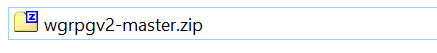
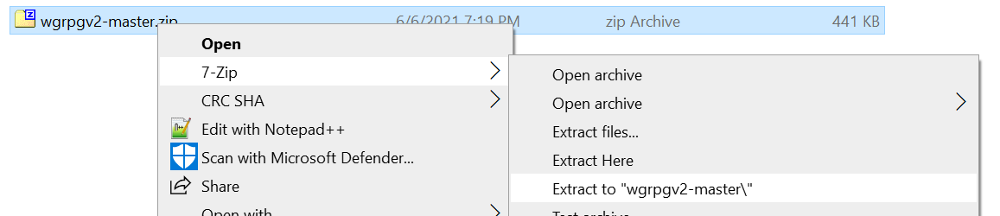
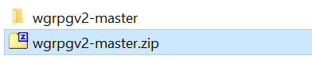

3. Rename the unzipped folder for convenience. 
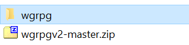

4. Download XAMPP from [here](https://www.apachefriends.org/download.html). Double click the file to install it. The specific location isn't important, but you'll need to remember where you installed it. These are the options needed to run the game. 

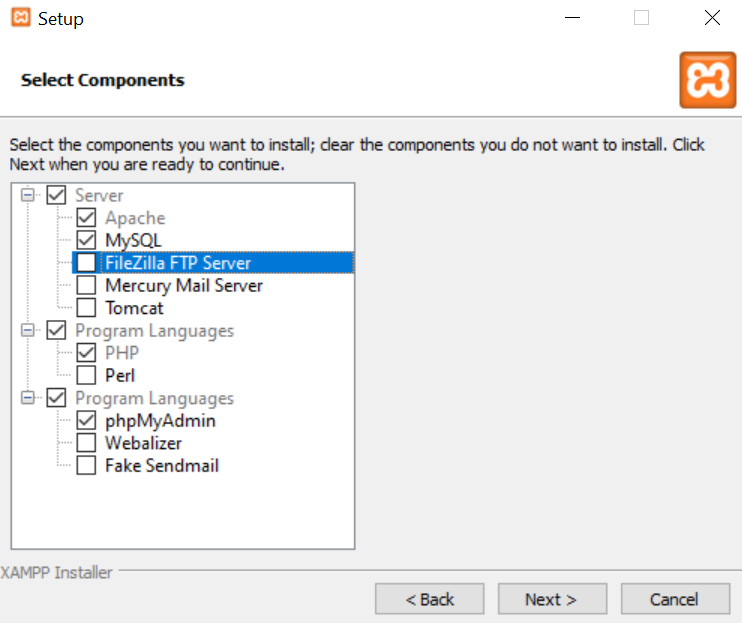

5. Uncheck Bitnami, that's not needed. 

6. Now that XAMPP is installed, copy the wgrpg folder into the htdocs folder inside the folder you installed XAMPP into. 
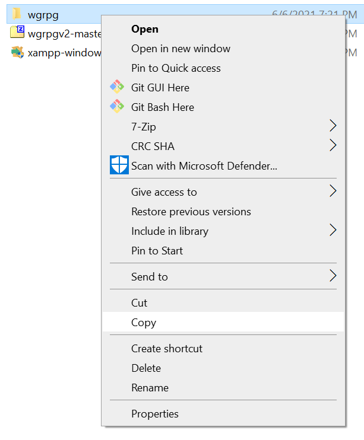
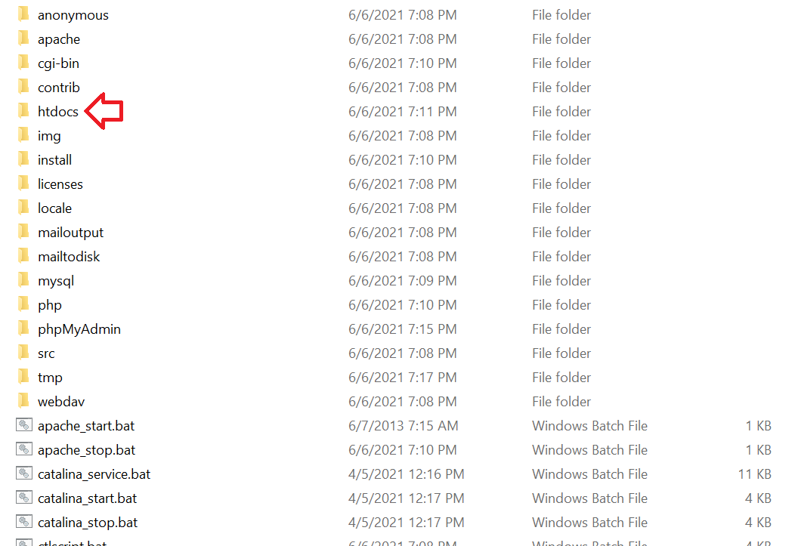
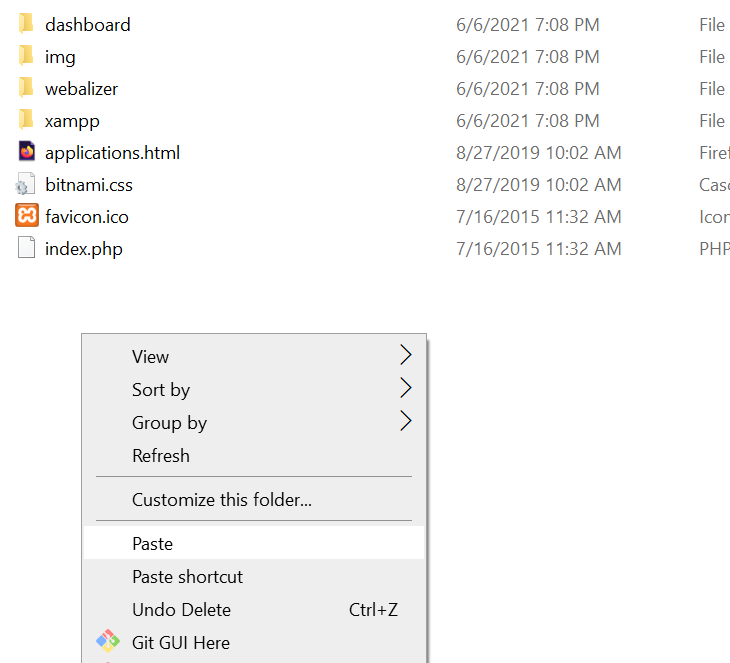

7. Now in your browser, go to localhost/phpmyadmin. Create a new database. 
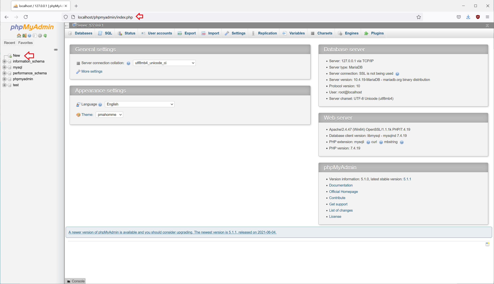

8. Name the new database wgrpg, and click create. 
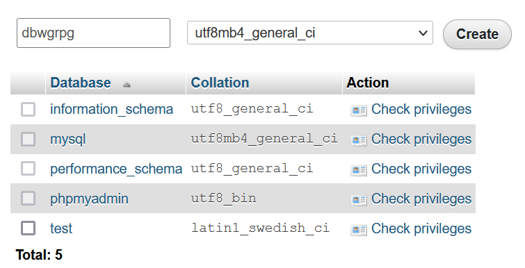

9. Click import. 
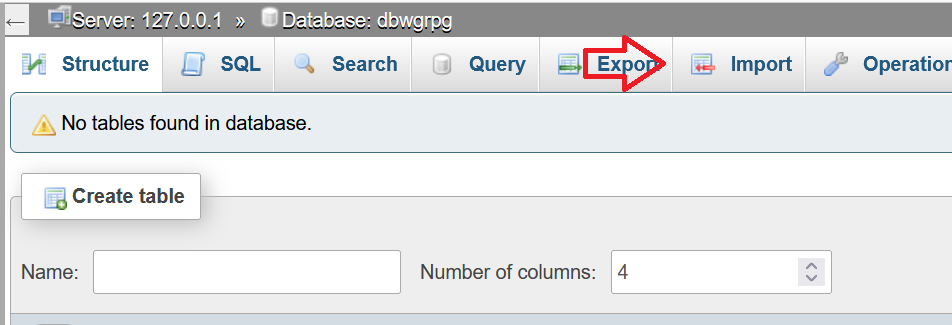

10. Click browse, and navigate to your XAMPP install folder, then htdocs\wgrpg\SQL. Select the dbwgrpg.sql file, then click Go. 
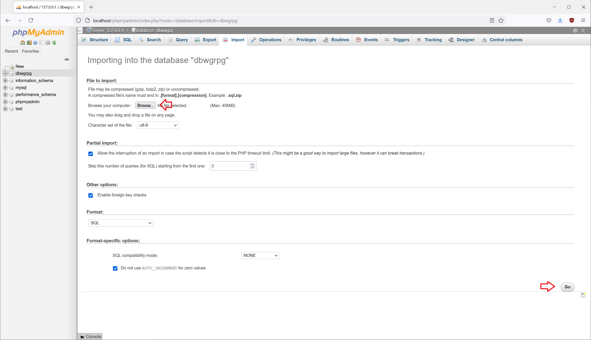
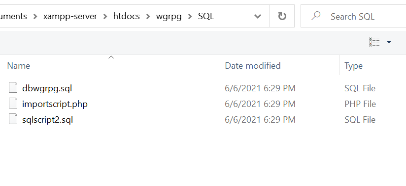

## Advanced

### Building the Docker image

To build the Docker image youself, download the repository and have Docker installed. Then, from your terminal in the repository folder, run the command: <code>docker build -t wgrpg .</code>

### Adding or removing persistent storage
By default, the run script will create a docker volume if one does not already exist. If you would like, you can do this manually with the command: 
<code>docker volume create dbwgrpg</code>

You can delete (permanently!) the volume with the command: 
<code>docker volume rm dbwgrpg</code>

### Running the container

To run the image after you have built it and added a volume, use the command: 
<code>docker run -it --rm -p8401:80 -v dbwgrpg:/opt/lampp/var/mysql/ wgrpg</code>
