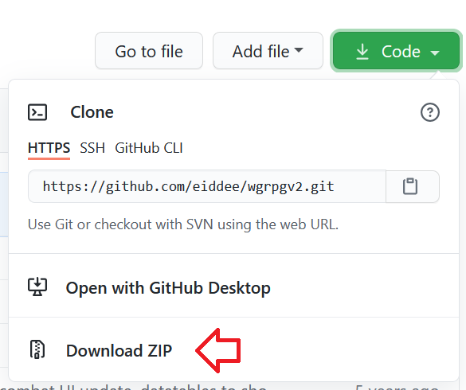

wgrpg
=====

Instructions
=====

Download the files in this repository in a zip file.

Unzip them.

Rename the unzipped folder for convenience.

Download XAMPP from [here](https://www.apachefriends.org/download.html). Double click the file to install it. The specific location isn't important, but you'll need to remember where you installed it.

These are the options needed to run the game.

Uncheck Bitnami, that's not needed.

Now that XAMPP is installed, copy the wgrpg folder into the htdocs folder inside the folder you installed XAMPP into.

Now in your browser, go to localhost/phpmyadmin. Create a new database.

Name the new database wgrpg, and click create.

Click import.

Click browse, and navigate to your XAMPP install folder, then htdocs\wgrpg\SQL. Select the dbwgrpg.sql file, then click Go.

Once it's done importing, navigate to localhost/wgrpg and register an account. If everything was done correctly, the game will be ready to play.